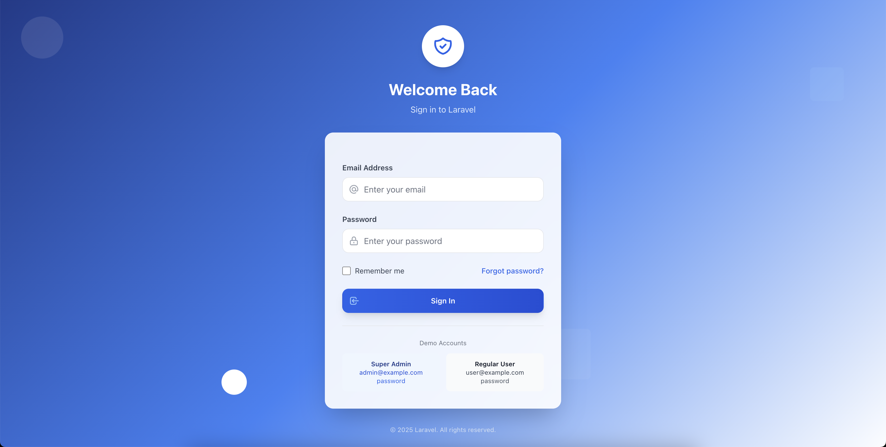
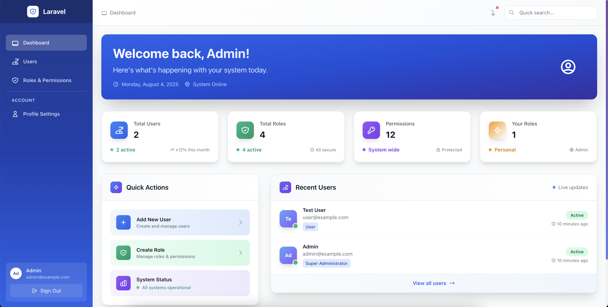

# Laravel Boilerplate Core - User Management & Role-Based Authorization

A comprehensive Laravel boilerplate built with Domain-Driven Design (DDD) architecture, featuring complete user management and dynamic role-based authorization system with Tailwind CSS and Livewire.

## 🎯 Product Overview

This boilerplate provides a solid foundation for web applications that require sophisticated user management and permission systems. Built as a Minimal Viable Product (MVP), it allows developers to immediately start building their unique features on top of a robust authorization framework.

## 🚀 Key Features

### Core Architecture
- **Domain-Driven Design (DDD)** structure for User, Role, and Permission domains
- **Actions** for business logic separation
- **Models** for database interactions
- **DataTransferObjects** for validation and data transfer
- Clean, maintainable code following Laravel best practices

### User Management System
- Complete CRUD operations for users
- User profile management (self-editing)
- Secure authentication system (login, register, forgot password)
- Email verification
- User status management

### Dynamic Role & Permission System
- **Roles Management**: Create, edit, delete roles (Admin, Manager, Editor, etc.)
- **Permissions Management**: Define granular permissions (create-post, edit-user, etc.)
- **Role Assignment**: Assign multiple roles to users
- **Permission Assignment**: Assign permissions to roles
- **Dynamic Authorization**: Real-time permission checking

### Security & Authorization
- **Middleware Protection**: Route-level permission checks
- **Blade Directives**: `@can`, `@role` for UI element control
- **Dynamic UI Controls**: Show/hide buttons based on user permissions
- **Secure Password Management**: Hashing, reset functionality

### Modern Frontend Stack
- **Tailwind CSS**: Clean, responsive, customizable design
- **Livewire**: Dynamic user experience without page reloads
- **Blade Components**: Reusable UI components (buttons, forms, tables)
- **Alpine.js**: Lightweight JavaScript interactions

## 🏗️ Project Structure

```
app/
├── Domains/
│   ├── User/
│   │   ├── Actions/
│   │   ├── Models/
│   │   └── DataTransferObjects/
│   ├── Role/
│   │   ├── Actions/
│   │   ├── Models/
│   │   └── DataTransferObjects/
│   └── Permission/
│       ├── Actions/
│       ├── Models/
│       └── DataTransferObjects/
├── Http/
│   ├── Controllers/
│   ├── Middleware/
│   └── Livewire/
└── View/
    └── Components/
```

## 🎯 Target Market

### Primary Users
- **Individual Developers**: Looking for a solid foundation with user management
- **Development Teams**: Need a proven authorization structure to build upon
- **Startups**: Require rapid development with enterprise-grade security
- **Agencies**: Building multiple client projects with similar auth requirements

### Use Cases
- **SaaS Applications**: Multi-tenant systems with role-based access
- **Admin Panels**: Content management systems with different user levels
- **E-commerce Platforms**: Customer and admin role separation
- **Corporate Applications**: Department-based access control

## 🛠️ Technology Stack

- **Backend**: Laravel 11+ (Latest)
- **Frontend**: Tailwind CSS 3+, Livewire 3+, Alpine.js
- **Database**: MySQL/SQLite (configurable)
- **Authentication**: Laravel Sanctum
- **Testing**: PHPUnit, Laravel Dusk
- **Code Quality**: Laravel Pint, PHPStan

## 📦 What You Get

### Immediate Value
1. **Production-Ready Auth System**: Complete user management out of the box
2. **Scalable Architecture**: DDD structure supports complex feature additions
3. **Security Best Practices**: Properly implemented authorization patterns
4. **Clean UI Components**: Professional-looking interface ready for customization
5. **Documentation**: Comprehensive setup and usage guides

### Long-term Benefits
- **Time Savings**: Skip months of auth system development
- **Security Confidence**: Battle-tested permission patterns
- **Scalability**: Architecture supports enterprise-level applications
- **Maintainability**: Clean code structure for easy team collaboration

## 🚀 Quick Start

```bash
# Clone the project
git clone [repository-url]
cd laravel-boilerplate-core

# Install dependencies
composer install
npm install

# Setup environment
cp .env.example .env
php artisan key:generate

# Setup database
php artisan migrate --seed

# Build assets
npm run build

# Start development server
php artisan serve
```

## 📋 Default Credentials

After seeding, you can login with:
- **Admin**: admin@example.com / password
- **Manager**: manager@example.com / password
- **User**: user@example.com / password

## 🔧 Configuration

### Environment Variables
```env
# Database Configuration
DB_CONNECTION=mysql
DB_HOST=127.0.0.1
DB_PORT=3306
DB_DATABASE=laravel_boilerplate
DB_USERNAME=root
DB_PASSWORD=

# Mail Configuration (for password reset)
MAIL_MAILER=smtp
MAIL_HOST=smtp.mailtrap.io
MAIL_PORT=2525
MAIL_USERNAME=null
MAIL_PASSWORD=null
```

## 🎨 Customization

### Styling
- Modify `tailwind.config.js` for brand colors
- Update Blade components in `resources/views/components/`
- Customize Livewire components in `app/Http/Livewire/`

### Business Logic
- Add new permissions in `database/seeders/PermissionSeeder.php`
- Create new roles in `database/seeders/RoleSeeder.php`
- Extend user actions in `app/Domains/User/Actions/`

## 🧪 Testing

```bash
# Run PHP tests
php artisan test

# Run frontend tests
npm run test

# Code quality checks
./vendor/bin/pint
./vendor/bin/phpstan analyse
```

## 📸 Screenshots

### Login Page


### Dashboard


### User Management


### Role Management


### Profile Settings


## 📖 Documentation

- [Installation Guide](docs/installation.md)
- [Architecture Overview](docs/architecture.md)
- [User Management](docs/user-management.md)
- [Roles & Permissions](docs/roles-permissions.md)
- [Customization Guide](docs/customization.md)
- [API Documentation](docs/api.md)

## 🤝 Support

- **Documentation**: Comprehensive guides and examples
- **Code Comments**: Well-documented codebase
- **Best Practices**: Following Laravel and PHP standards
- **Community**: Active discussion and updates

## 📄 License

This project is open-sourced software licensed under the [MIT license](https://opensource.org/licenses/MIT).

## 🏆 Features Checklist

- ✅ User CRUD operations
- ✅ Role & Permission management
- ✅ Dynamic authorization middleware
- ✅ Blade directives for UI control
- ✅ Responsive Tailwind CSS design
- ✅ Livewire dynamic components
- ✅ Secure authentication system
- ✅ Email verification
- ✅ Password reset functionality
- ✅ Database seeders with sample data
- ✅ Comprehensive test coverage
- ✅ Clean DDD architecture
- ✅ Production-ready configuration

---

**Ready to build your next application on a solid foundation? This boilerplate eliminates months of development time while providing enterprise-grade security and scalability.**
